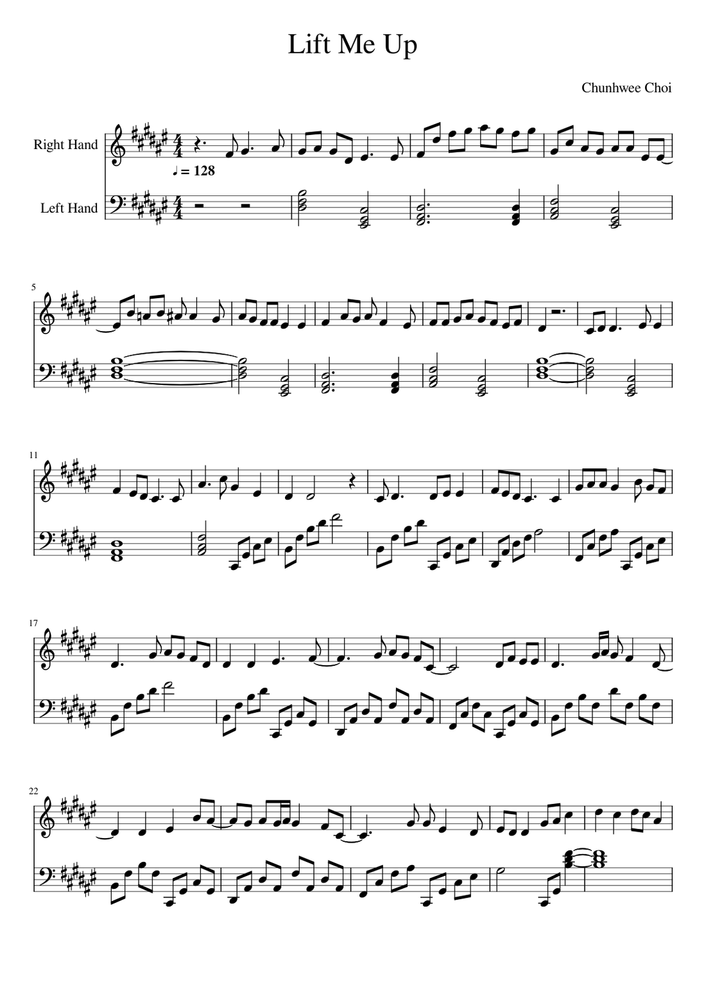

# [Project Name] — Audio to Piano Sheet Music

Turn any song into playable, human-readable piano sheet music. Audio in,
MuseScore-ready MusicXML out — fully automatic.

**[▶ Try the live demo](https://huggingface.co/spaces/YOUR_USERNAME/YOUR_SPACE)** ·
**[▶ Watch the demo video](YOUR_YOUTUBE_LINK)**


*First page of the transcription of "Lift Me Up" (original composition), generated
entirely by the pipeline and rendered in MuseScore.*

## What it does

Given a full mix (mp3/wav), the pipeline produces a grand-staff piano
arrangement: the vocal melody on the treble clef, and a chord-driven
accompaniment on the bass clef that adapts its busyness to the energy of the
actual recording.

The pipeline runs in ten cached stages:

1. **Stem separation** — Demucs splits the mix into vocals / bass / drums / other
2. **Accompaniment mixdown** — a beat-tracking reference track is built from the non-vocal stems
3. **Pitch tracking** — torchcrepe extracts the vocal pitch contour (cached, so re-runs are instant)
4. **Melody extraction** — the contour becomes note events: confidence gating, energy rescue, octave-outlier folding, half-step-trill collapse
5. **Melody extension** — sustained syllables are held to their true sung length
6. **Chord recognition** — chroma template matching over the bass + harmony stems, beat-aligned via madmom
7. **Instrumental rest fill** — long vocal rests are filled with the lead instrumental line (BasicPitch)
8. **Grand-staff assembly** — everything is quantized to a 16th-note grid, spelled correctly for the key, and written as MusicXML
9. **Bass-clef silence detection** — the accompaniment rests where the actual recording rests, measured from stem energy
10. **Accompaniment variation** — each section gets a texture (calm / medium / busy, five voicings each) chosen from the drum-onset energy of the recording

Every stage caches its output and version-gates it, so changing one stage
rebuilds only what depends on it. An optional **seed** produces controlled
variant sheets — different rhythm micro-decisions and accompaniment patterns —
while the default run is byte-identical every time.

## Design principles

- **Measure the audio, don't guess from symbols.** Accompaniment density,
  bass-clef rests, and section boundaries are driven by actual signal energy
  (STFT band energy, drum onset strength), not by symbolic heuristics.
- **Each stage owns its domain.** No stage re-processes what an upstream stage
  already decided.
- **Playability over raw accuracy.** The goal is sheet music a pianist would
  actually read, so the pipeline prefers clean durations and stable octaves
  over transcribing every micro-fluctuation.

## What didn't work (honestly)

- **Loosened beat grids** made rhythm marginally different but cut real notes;
  after A/B testing across versions, the strict grid won.
- **Vibrato vs. ornament** cannot be reliably separated with heuristics — a
  trained model would be needed. Residual imperfections here are accepted.
- **Stale cached intermediates** silently poisoned early results until every
  cached sheet gained a version sidecar that forces rebuilds when the cleanup
  logic changes.

## Install

Requires Python 3.11 and [ffmpeg](https://ffmpeg.org)
(`brew install ffmpeg` on macOS).

```bash
git clone https://github.com/YOUR_USERNAME/YOUR_REPO.git
cd YOUR_REPO
python3.11 -m venv piano_env
source piano_env/bin/activate
pip install -r requirements.txt
```

If `madmom` fails to build, see the note inside `requirements.txt`.

## Use

**Interactive (recommended):**

```bash
python pipeline.py
```

You'll be asked for the audio file (place songs in `data/input/`), an optional
seed, and whether to regenerate from scratch. The final sheet lands in
`output/<song>/` — open the file the pipeline names as **DONE** in MuseScore
(files with `_base`/`_silenced` in the name are intermediates).

**Programmatic:**

```python
from pipeline import run_pipeline
final_xml = run_pipeline("data/input/song.mp3", seed=None, force=False)
```

**Web demo (local):**

```bash
python app.py    # then open http://127.0.0.1:7860
```

## A note on copyright

This repo contains no copyrighted audio. The included example ("Lift Me Up") is
my own composition. The tool transcribes audio you supply; what you do with
transcriptions of other people's music is subject to the usual copyright rules.

## Built with

[Demucs](https://github.com/facebookresearch/demucs) ·
[torchcrepe](https://github.com/maxrmorrison/torchcrepe) ·
[madmom](https://github.com/CPJKU/madmom) ·
[Basic Pitch](https://github.com/spotify/basic-pitch) ·
[music21](https://github.com/cuthbertLab/music21) ·
[librosa](https://librosa.org) · pretty_midi

## License

MIT — see [LICENSE](LICENSE).

Built and iterated over [N] months as an independent project. Full development
journal available on request.
